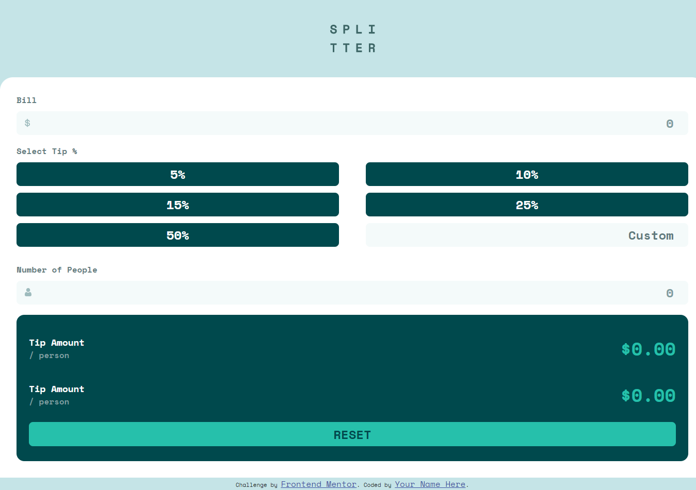

# tip calculator app

A simple calculator for a Frontend Mentor challenge

## Tech Stack

**Client:** HTML and Sass

## Run Locally

Clone the project

```bash
  git clone https://github.com/hafezfhmi/tip-calculator-app.git
```

Go to the project directory

```bash
  cd tip-calculator-app
```

Install SASS (optional)

```bash
npm install -g sass
```

Compile scss to css (optional)

```bash
sass --watch style.scss style.css
```

Open `index.html` in your browser

## Screenshots



## Demo

https://tip-calculator-app.hafezfhmi.com
